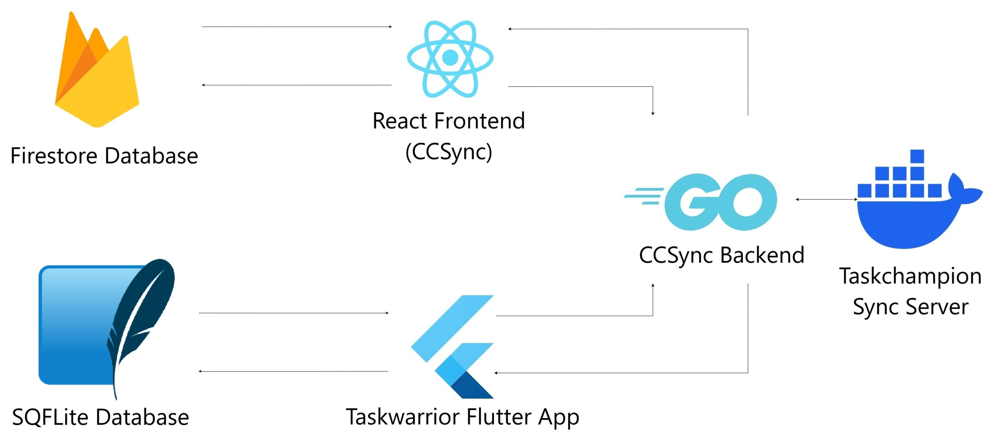

# Developing for CCSync

This section gives a brief information about almost everything that you would need to setup CCSync for development, or deployment.

If you still have any queries, contact us on [Github](https://github.com/its-me-abhishek/ccsync-docs)

---

## Environment Architecture

The diagram below is a representation of how various components are connected to enable sync on the CCSync website, and the [Taskwarrior Flutter App](https://github.com/CCExtractor/taskwarrior-flutter)

---

## Setting up a Development Environment

---

### Prerequisites

- Docker

- Google OAuth Keys

### Steps to setup the frontend

1.  Navigate to the frontend directory and run the command:

        npm install

2.  Create a `.env` file in the same directory.

3.  If you want to use docker, set the environment variables in `.env` as:

        VITE_BACKEND_URL="http://localhost:8000/" # this is the backend to which the app or the web frontend interacts with
        VITE_FRONTEND_URL="http://localhost:80" # the url of our web frontend, so as to avoid CORS based errors
        VITE_CONTAINER_ORIGIN="http://localhost:8080/" # url of the deployed taskchampion-sync-server container

4.  Else, set the environment variables in `.env` as:

        VITE_BACKEND_URL="http://localhost:8000/" # this is the backend to which the app or the web frontend interacts with
        VITE_FRONTEND_URL="http://localhost:5173" # the url of our web frontend, so as to avoid CORS based errors
        VITE_CONTAINER_ORIGIN="http://localhost:8080/" # url of the deployed taskchampion-sync-server container

5.  Run the frontend container only:

        docker-compose build frontend
        docker-compose up

### Steps to setup the backend

1.  Navigate to the backend directory and run the commands:

        go mod download
        go mod tidy

2.  Create a `.env` file in the same directory.

3.  Go to [Google cloud credential page](https://console.cloud.google.com/apis/credentials) for generating client id and secret.

4.  If you want to use docker, set the environment variables in `.env` as:

        CLIENT_ID="client_ID" # Google Auth Secret
        CLIENT_SEC="client_SECRET" # Google Auth Secret
        REDIRECT_URL_DEV="http://localhost:8000/auth/callback" 
        SESSION_KEY="generate a secret key using 'openssl rand -hex 32'"
        FRONTEND_ORIGIN_DEV="http://localhost" # the url of the web frontend, so as to avoid CORS errors
        CONTAINER_ORIGIN="http://YOUR_CONTAINER_NAME:8080/" # url of the deployed taskchampion-sync-server container

5.  Else, set the environment variables in `.env` as:

        CLIENT_ID="client_ID" # Google Auth Secret
        CLIENT_SEC="client_SECRET" # Google Auth Secret
        REDIRECT_URL_DEV="http://localhost:8000/auth/callback"
        SESSION_KEY="generate a secret key using 'openssl rand -hex 32'"
        FRONTEND_ORIGIN_DEV="http://localhost:5173" # the url of the web frontend, so as to avoid CORS errors
        CONTAINER_ORIGIN="http://localhost:8080/" # url of the deployed taskchampion-sync-server container

6.  Run the backend container only:

        docker-compose build backend
        docker-compose up

**Note:** If you plan to run the backend without Docker, run it as a `root` user preferably on `WSL` or any Linux Distro with a user that has elevated permissions to modify files and directories.

**Note:** The Taskchampion sync server is currently being pulled from the repository [here](https://github.com/GothenburgBitFactory/taskchampion-sync-server).

### Steps to setup the Taskwarrior Flutter app with CCSync

1.  For development/personal purposes, in order to use CCSync with Taskwarrior Flutter app, one needs to setup only
    the backend and the sync server. The frontend setup is optional.

2.  Open the `api_service.dart` file.

3.  For baseUrl, replace `http://YOUR_IP:8000` with the deployed API endpoint. YOUR_IP refers to the IP address of the terminal or Docker container that is hosting the backend currently.

4.  For origin, replace `http://localhost:8080` with the deployed sync server endpoint.

5.  Set `sync.server.origin` in your Taskwarrior configuration to the deployed sync server URL.

6.  Here's how your api_service.dart should look after these changes:

        class ApiService {
        // Use deployed values for baseUrl and origin
                String baseUrl = 'http://deployed-api-endpoint.com'; // replace with actual deployed API endpoint
                String origin = 'http://deployed-sync-server-endpoint.com'; // replace with actual deployed sync server endpoint, although, for now, it is just a placeholder until next release or update
        // Other ApiService code...
        }

7.  Run the app.

### Troubleshooting

The sync might break most of the times due to wrong `.env` variables. Please ensure that your docker containers are
visible and accessible, using `ping <container_address>` commands.

---

## Testing

- For testing backend, first navigate to the backend directory, and then run the tests

        cd backend
        go test <package_name>

Here, `package_name` is the test suite you want to run.

- Similarly, for testing frontend, first navigate to the frontend directory, and then run the tests

        cd frontend
        npm test

- `Note`: In order to setup / run tests for pages that have any URLs, for example, the `HomePage.tsx`, toggle the `isTesting` to `true` in `frontend/src/components/utils/URLs.ts`

---

## Google OAuth Keys

Before starting the frontend, Go to [Google cloud credential page](https://console.cloud.google.com/apis/credentials) for generating client id and secret. Read [this guide for more information on these credentials and how these work](https://developers.google.com/identity/protocols/oauth2). Follow these steps:

1.  Go to Google's developer console.

2.  Create a new project.

3.  From within your project, create a new "Client ID" by going to "APIs & Auth" > "Credentials" and clicking on the "Create New Client ID" button.

4.  Select "Web Application"

5.  Enter the following for 'Authorized Javascript Origins':

        http://127.0.0.1
        http://localhost

6.  Enter the following for 'Authorized Redirect URI':

        http://127.0.0.1:8000/callback/

7.  Save

8.  You will be presented with your newly generated credentials that are required for setting up the backend.

---
