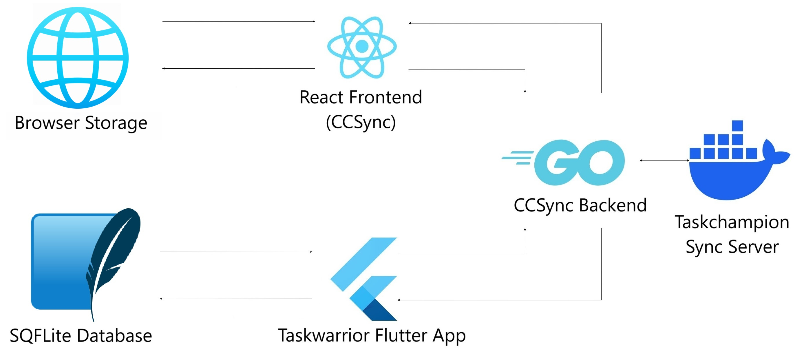

# Developing for CCSync

This section gives a brief information about almost everything that you would need to setup CCSync for development, or deployment.

If you still have any queries, contact us on [Github](https://github.com/its-me-abhishek/ccsync-docs)

---

## Environment Architecture

The diagram below is a representation of how various components are connected to enable sync on the CCSync website, and the [Taskwarrior Flutter App](https://github.com/CCExtractor/taskwarrior-flutter)

---

## Setting up a Development Environment

---

#### Prerequisites

- Docker
- Google OAuth Keys
- Firestore Configuration

#### Setup

#### Troubleshooting

---

## Testing

---

## Google OAuth Keys

---

## Firestore configuration